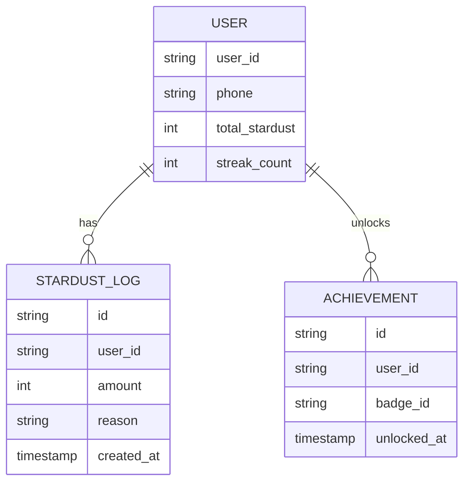

# 《心辰手记》产品全案蓝图 (Product Blueprint)

**版本**: V1.2  
**定位**: 鸿蒙原生 (HarmonyOS Next) 治愈系情绪记录与自我探索 App

---

## 第一部分：需求分析 (PRD)

### 1. 核心价值主张
*   **痛点**: 碎片化的情绪无处安放，流行的MBTI/星座理论缺乏个性化的日常结合。
*   **解决方案**: 一个将"情绪日记"与"星辰/人格指引"深度融合的私密空间。

### 2. 设计理念

> [!IMPORTANT]
> **2024 心理健康 App 设计核心趋势**
> - **极简导航**：用户记录情绪时往往处于脆弱状态，降低认知负荷至关重要。
> - **情感化设计**：营造平静、安全的视觉环境，唤起积极情绪。
> - **游戏化激励**：引入「星辰」收集机制，提升长期使用粘性。
> - **隐私优先**：本地优先存储，所有数据保留在设备上。

### 3. 功能模块拆解

#### A. 情绪日记 (Core)
*   **极速记录**:
    *   **Mood Picker**: 7种基础情绪Emoji（开心、平静、焦虑、疲惫、愤怒、悲伤、期待）。
    *   **Intensity Slider**: 1-5分强度滑块。
    *   **Tags**: 场景标签（工作、学习、深夜、独处等）。
*   **富文本日记**: 支持插入图片（鸿蒙图库选择）、语音片段。
*   **时间轴**: 首页以时间轴形式展示日记卡片，支持按月折叠。

#### B. 星辰档案 (Identity)
*   **MBTI配置**: 用户设定自己的类型（如INFP），系统根据类型每日推送一条"能量建议"。
*   **星座运势**: 基于简单随机算法或静态配置，每日一句基于星象的治愈文案。
*   **融合分析**: 当用户记录"焦虑"时，结合其MBTI推送针对性建议。

#### C. 探索工具 (Tools) ✨ 强化
*   **星之呼吸**: 视觉化呼吸练习，配合毛玻璃动态光斑的节奏律动，完成后奖励星辰积分。
*   *   **情绪垃圾桶**: 实现“烦恼粉碎”效果，用户输入烦恼，点击粉碎后文字化作粒子消散（动效模拟）。

#### D. 数据洞察 (Stats) ✨ 强化
*   **情绪月历**: 时间轴页面的扩展视图，用颜色球标记每日主导情绪。
*   **人格指引**: 结合 MBTI + 情绪记录逻辑，在本地通过预置文案库推送“今日星语”。
*   **情绪月历**: 用颜色标记每一天的心情。
*   **心情曲线**: 折线图展示一周心情波动。

#### E. 游戏化激励：星辰系统 (Stardust System) ✨ 强化
*   **星辰收集**: 每日完成情绪记录或呼吸练习可获得「星辰」奖励。
*   **连续记录徽章**: 7天/30天/100天连续打卡成就。
*   **本地存储**: 積分数据暂存于本地，确保离线状态下的即时反馈。

---

## 第二部分：UI/UX 设计风格指南 (Visual Guide)

### 1. 视觉主题：双重人格 (Dual Persona)

项目支持两套截然不同的视觉主题，以适应用户的心境变化：

*   **🌑 深色模式 (Deep Space / 星辰深空)**
    *   **关键词**: 神秘、静谧、沉浸、独处。
    *   **适用场景**: 深夜记录、情绪低落、需要安抚时。
    *   **特征**: 午夜蓝背景 + 冷白文字 + 金色微光。

*   **☀️ 浅色模式 (Morning Light / 晨曦暖阳)**
    *   **关键词**: 温暖、治愈、明亮、希望。
    *   **适用场景**: 日间回顾、心情积极、能量释放时。
    *   **特征**: 暖米色背景 + 深棕文字 + 琥珀色辉光 + 玉石质感。

### 2. 生态配色系统 (Color System)

| 语义变量 | Deep Space (Dark) | Morning Light (Light) | 说明 |
| :--- | :--- | :--- | :--- |
| **primaryBg** | `#0F172A` (Midnight) | `#FFF7ED` (Warm Beige) | 全局背景 |
| **cardBg** | `rgba(255,255,255, 0.05)` | `rgba(255,255,255, 0.4)` | 卡片底色 |
| **textPrimary** | `#F8FAFC` (Cold White) | `#431407` (Deep Brown) | 主要文字 |
| **textSecondary** | `rgba(248,250,252, 0.6)` | `rgba(67,20,7, 0.5)` | 次要信息 |
| **accent** | `#FCD34D` (Starlight) | `#F59E0B` (Amber) | 强调/积分/按钮 |
| **cardBorder** | `rgba(255,255,255, 0.15)` | `rgba(255,255,255, 0.6)` | 边框 (浅色更明显) |

### 3. 毛玻璃拟态规范 (Glassmorphism 2.0)

**深色模式 (沉浸感)**
```typescript
.backgroundColor('rgba(255, 255, 255, 0.05)')
.backdropBlur(20)
.border({ width: 1, color: 'rgba(255, 255, 255, 0.15)' })
.shadow({ radius: 20, color: 'rgba(0, 0, 0, 0.2)', offsetY: 4 })
```

**浅色模式 (通透感)**
```typescript
.backgroundColor('rgba(255, 255, 255, 0.4)')
.backdropBlur(30) // 更高的模糊度
.saturate(1.8)    // 增加饱和度 (需 ImageEffect 支持，或通过背景色调整)
.border({ width: 1, color: 'rgba(255, 255, 255, 0.6)' })
.shadow({ 
  radius: 30, 
  color: 'rgba(251, 191, 36, 0.15)', // 暖色投影
  offsetY: 8 
})
```

### 4. 关键组件视觉

#### 按钮 (Buttons)
*   **FAB (悬浮按钮)**: 渐变色填充 (`#FCD34D` → `#F97316`)，带有**呼吸动效** (3s 循环缩放)，模拟恒星律动。
*   **次级按钮**: 深色模式下为白色半透明幽灵按钮；浅色模式下为深棕色轮廓按钮。

#### 动效 (Motion)
*   **页面背景**: 使用径向渐变 (RadialGradient) 叠加，浅色模式下模拟晨光漫射效果。
*   **卡片按压**: 缩放至 98%，阴影收缩。

---

## 第三部分：技术架构与实施 (TechSpec)

### 1. 存储架构：本地优先 (Local-First)

> [!NOTE]
> 为了平衡隐私与数据安全性，本项目采用本地存储为主、备份为辅的架构。

*   **数据持久化**:
    *   **RelationalStore (SQLite)**: 存储日记条目、情绪记录、标签、星辰获取历史日志。
    *   **Preferences**: 存储用户设置 (MBTI, 星座)、当前「星辰」总数、连续打卡天数。
*   **数据安全保障**:
    *   **华为云备份**: 接入鸿蒙系统级云空间备份能力。
    *   **手动导出/导入**: 提供 JSON/ZIP 格式的数据导出功能，允许用户手动备份或迁移。

### 2. 目录结构规范
(保持原有 HarmonyOS 结构，详见 CLAUDE.md)

---

## 第四部分：开发路线图 (Roadmap)

| 阶段 | 目标 | 备注 |
| :--- | :--- | :--- |
| **Phase 1 骨架** | 搭建项目基础与本地存储 | 完成 SQLite 和 Preferences 的封装 |
| **Phase 2 UI** | 核心界面与毛玻璃体验 | 完成时间轴与编辑页 |
| **Phase 3 功能** | 星辰系统与档案逻辑 | 本地积分逻辑与 MBTI 推送 |
| **Phase 4 安全** | 本地备份与手动导出 | 实现数据导入导出功能 |
| **Phase 5 账号** | **[待定/先不做]** 云端同步 | 接入后端服务器与账号系统 |

---

## 第五部分：隐私原则
*   **数据不出门**: 默认所有隐私数据仅保存在用户设备。
*   **透明备份**: 明确提示备份范围及方式。

---

## 第六部分：云端远景架构计划 (Future Expansion)

> [!NOTE]
> **本章节内容仅作为架构储备方案，当前 Phase 1-4 阶段不进行任何开发实现。**

### 1. 后端技术栈建议
*   **框架**: Node.js (NestJS / Hono) 或 Go (Gin)
*   **数据库**: PostgreSQL (主数据库) + Redis (缓存/打卡频率限制)
*   **认证**: 接入华为账号服务 (Huawei ID) 或 JWT 令牌

### 2. 云端功能框架
当未来决定接入后端时，将实现以下功能：

#### A. 账号与星辰同步 (Essential)
*   **星辰总余额**: 服务端作为受信源，确保積分不会因换机或清除缓存丢失。
*   **成就同步**: 解锁的勋章ID全国唯一识别，随账号永久绑定。
*   **反作弊校验**: 简单校验打卡时间间隔，防止通过修改系统时间刷星辰。

#### B. 数据中转与备份 (Standard)
*   **加密快照**: 本地 SQLite 数据库的加密压缩包备份至服务器。
*   **增量同步**: (高级功能) 仅同步新增的日记条目，减少流量消耗。

#### C. 社区与治愈生态 (Optional)
*   **匿名星空 (树洞)**: 用户可以发布匿名日记碎片的“星河”，其他用户可以投掷“星光(点赞)”给予治愈。
*   **合力呼吸**: 实时在线的多人呼吸练习房。

### 3. 云端数据模型设计 (Schema Draft)

